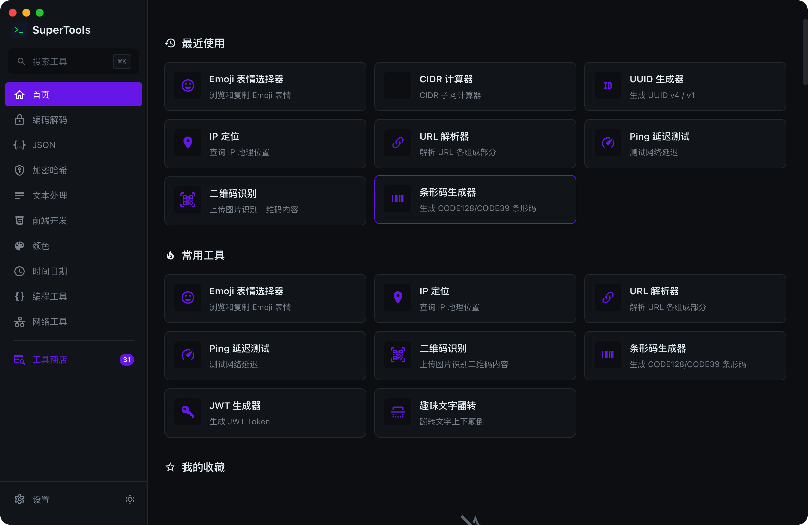
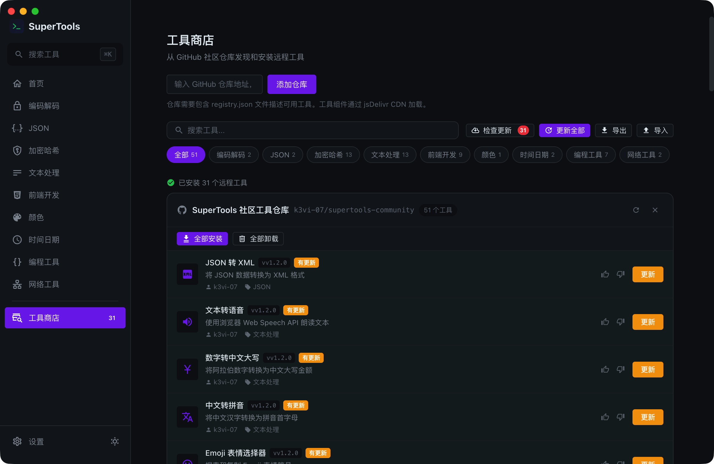
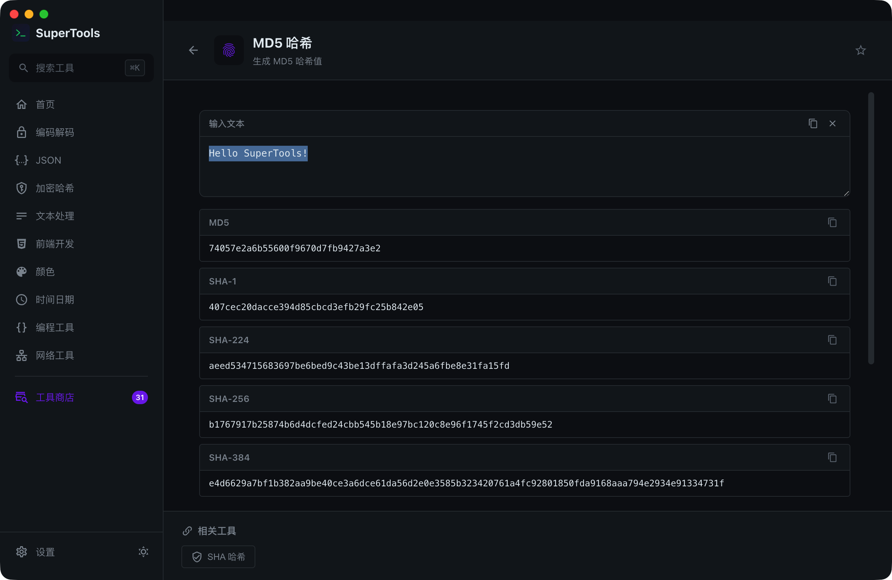

<div align="center">

# 🛠️ SuperTools

### 开发者超级工具箱

**136+ 内置工具 · 远程插件系统 · 智能搜索 · 剪贴板识别**

[](https://www.electronjs.org/)
[](https://vuejs.org/)
[](https://www.typescriptlang.org/)
[](LICENSE)
[](#-内置工具136-个)
[](https://k3vi-07.github.io/supertools/)

基于 Electron + Vue 3 + TypeScript 构建的跨平台开发者工具箱桌面应用。

</div>

---

## ✨ 核心特性

| 特性 | 说明 |
|------|------|
| 🔍 **智能模糊搜索** | `Option+Space` 全局唤起 Spotlight 风格搜索浮层，Fuse.js 模糊匹配 |
| 📋 **剪贴板智能识别** | 自动检测剪贴板内容类型（JSON/Base64/URL/JWT/UUID 等 16 种），推荐对应工具 |
| 🏠 **个性化主页** | 最近使用、最常使用、收藏工具三大板块 |
| 🌙 **深色/浅色模式** | 手动切换，CSS 变量主题系统 |
| 🧩 **插件化架构** | 工具自动注册（`import.meta.glob`），零配置新增工具 |
| 🌐 **远程工具商店** | 从 GitHub 仓库动态加载远程工具（vue3-sfc-loader 运行时编译） |
| ⌨️ **全局快捷键** | `Option+Space` 呼出 · `⌘+K` 搜索 · `⌘+Shift+Space` 快速搜索 |

## 🚀 快速开始

### 环境要求

- **Node.js** >= 18
- **npm** >= 9

### 安装与运行

```bash
# 克隆仓库
git clone https://github.com/k3vi-07/supertools.git
cd supertools

# 安装依赖（国内用户建议设置 Electron 镜像）
export ELECTRON_MIRROR="https://npmmirror.com/mirrors/electron/"
npm install

# 开发模式
npm run dev

# 构建
npm run build

# 打包（macOS / Windows / Linux）
npm run build:mac
npm run build:win
npm run build:linux
```

### macOS 安装须知

由于没有 Apple 开发者签名，macOS 下载后可能提示「已损坏，无法打开」或「无法验证开发者」。解决方法：

```bash
# 方法一：终端解除隔离属性（推荐）
xattr -cr /Applications/SuperTools.app

# 方法二：系统偏好设置 → 安全性与隐私 → 允许打开
```

> 这是未签名开源应用的常见问题，应用本身安全，代码完全开源可审查。

## ⌨️ 快捷键

| 功能 | macOS | Windows / Linux |
|------|-------|-----------------|
| 呼出 / 隐藏主窗口 | `Option + Space` | `Alt + Space` |
| 快速搜索浮层 | `⌘ + Shift + Space` | `Ctrl + Shift + Space` |
| 应用内搜索 | `⌘ + K` | `Ctrl + K` |

## 🧰 内置工具（136 个）

### 编码解码（12）

URL 编解码 · Base64 · Base32 · Base58 · Base62 · HTML 实体 · Hex/ASCII · Unicode · 摩斯密码 · 二维码生成 · ASCII 码表 · Punycode

### JSON（19）

格式化 · 压缩 · 校验 · 转 TypeScript/Go/C#/Java/Kotlin/Python/Rust/C++/PHP/Ruby/Swift/Dart/Scala · 路径提取 · YAML 互转 · CSV 互转

### 加密哈希（21）

MD5 · SHA-1/224/256/384/512/3 · RIPEMD-160 · HMAC · AES · RSA 密钥生成 · JWT 解析 · BCrypt · UUID · 密码生成 · CRC8/16/32 · Adler-32

### 文本处理（43）

大小写转换 · 去重 · 排序 · 对比 · Lorem Ipsum · Slug · 正则测试 · 文本统计 · 反转 · Tab/空格互转 · 查找替换 · 进制转换 · Markdown 预览 · **30 种表格格式互转**（CSV/TSV/JSON/HTML/Markdown/SQL 六格式双向）

### 前端开发（12）

时间戳转换 · 颜色格式转换 · Box Shadow · Border Radius · Flex 布局 · CSS 压缩 · HTML 转 JSX · 渐变生成 · 文字阴影 · 调色板 · Cron 解析 · HTTP 状态码

### 编程工具（22）

SQL/JS/CSS/HTML/XML 的 **格式化 + 压缩 + 转义 + 反转义**（5 语言 × 4 操作）

### 网络工具（5）

IP 格式化 · CIDR 计算器 · 端口速查表 · User-Agent 解析 · URL 解析

### 时间日期（2）

HMS 秒互转 · 全球时区转换

## 🌐 远程工具系统

SuperTools 支持从任意 GitHub 仓库动态加载远程工具插件。

### 工作原理

```
GitHub 仓库 (.vue 源码 + registry.json)
       ↓
jsDelivr CDN (全球加速 + CORS *)
       ↓
Electron 主进程 (net.fetch 代理，绕过 CORS)
       ↓ IPC 传输源码
渲染进程 (vue3-sfc-loader 运行时编译 .vue → Vue 组件)
       ↓
defineAsyncComponent + <Suspense> 渲染
```

### 使用远程工具

1. 打开应用 → 侧边栏点击 **"工具商店"**
2. 输入 GitHub 仓库地址（如 `k3vi-07/supertools-community`）
3. 浏览可用工具 → 点击 **"安装"**
4. 安装的工具自动出现在搜索和分类中

### 社区工具仓库

| 仓库 | 工具数 | 说明 |
|------|--------|------|
| [k3vi-07/supertools-community](https://github.com/k3vi-07/supertools-community) | 51 | 官方社区工具集 |

### 创建自己的远程工具仓库

#### 1. 初始化仓库

```bash
mkdir my-supertools-plugins && cd my-supertools-plugins
git init
mkdir tools
```

#### 2. 编写 registry.json

这是工具清单文件，描述仓库中所有工具的元数据：

```json
{
  "name": "我的工具集",
  "description": "我的自定义工具集合",
  "version": "v1.0.0",
  "tools": [
    {
      "id": "my-tool",
      "name": "My Tool",
      "nameZh": "我的工具",
      "icon": "mdi:tools",
      "category": ["text"],
      "keywords": ["my", "tool", "工具"],
      "description": "一个示例工具",
      "path": "tools/MyTool.vue",
      "author": "your-name",
      "version": "v1.0.0"
    }
  ]
}
```

**字段说明：**

| 字段 | 必填 | 说明 |
|------|------|------|
| `id` | ✅ | 工具唯一标识（英文 kebab-case，如 `my-tool`） |
| `name` | ✅ | 英文名称 |
| `nameZh` | ✅ | 中文名称 |
| `icon` | ✅ | [Material Design Icons](https://pictogrammers.com/library/mdi/) 图标名（`mdi:` 前缀） |
| `category` | ✅ | 分类数组，可选值见下表 |
| `keywords` | ✅ | 搜索关键词数组 |
| `description` | ✅ | 工具描述 |
| `path` | ✅ | `.vue` 文件相对路径（从仓库根目录开始） |
| `author` | ❌ | 作者名 |
| `version` | ❌ | 工具版本号 |

**可选分类：**

| 分类 ID | 名称 |
|---------|------|
| `encode` | 编码解码 |
| `json` | JSON |
| `cryptography` | 加密哈希 |
| `text` | 文本处理 |
| `web` | 前端开发 |
| `color` | 颜色 |
| `datetime` | 时间日期 |
| `programming` | 编程工具 |
| `network` | 网络工具 |

#### 3. 编写工具组件（.vue 文件）

工具是一个标准的 Vue 3 单文件组件。**注意：远程工具在浏览器端运行时编译，不能 `import` npm 包**，只能使用 Vue 内置 API 和全局注册的 `h-` 组件。

##### 模式一：输入→输出转换（使用 `<h-transform>`）

适合编码/解码/格式化类工具，自带双栏编辑器、复制、反转按钮：

```vue
<template>
  <h-single-layout>
    <h-transform
      left-title="输入"
      right-title="输出"
      :sample-data="sample"
      :input-handler="transformFn"
    />
  </h-single-layout>
</template>

<script setup lang="ts">
// 示例数据，用户打开工具时预填
const sample = 'Hello World'

// 转换函数：输入 string，返回 string
function transformFn(input: string): string {
  return input.toUpperCase()
}
</script>
```

##### 模式二：自定义布局（使用 `<h-single-layout>`）

适合需要自定义 UI 的工具（计算器、生成器等）：

```vue
<template>
  <h-single-layout>
    <div class="my-tool">
      <div class="my-tool__input">
        <input v-model="input" placeholder="输入内容..." @input="process" />
      </div>
      <div class="my-tool__output selectable">{{ output }}</div>
      <button @click="copy">复制结果</button>
    </div>
  </h-single-layout>
</template>

<script setup lang="ts">
import { ref } from 'vue'

const input = ref('')
const output = ref('')

function process() {
  output.value = input.value.split('').reverse().join('')
}

function copy() {
  window.$he3?.copyText(output.value)
  window.$he3?.message.success('已复制')
}
</script>

<style scoped>
.my-tool { display: flex; flex-direction: column; gap: 12px; }
.my-tool__input input {
  width: 100%; padding: 8px 12px;
  border: 1px solid var(--border-color); border-radius: 8px;
  background: var(--bg-surface); color: var(--text-primary);
}
.my-tool__output {
  padding: 12px; border-radius: 8px;
  background: var(--bg-surface); min-height: 60px;
}
</style>
```

#### 4. 可用的全局组件

| 组件 | 说明 | 常用 Props |
|------|------|-----------|
| `<h-single-layout>` | 单栏居中布局容器 | 无 |
| `<h-transform>` | 双栏输入→输出转换 | `:input-handler` (函数), `:sample-data` (示例), `left-title`, `right-title` |
| `<h-text-transform>` | 纯文本转换 | `:transform` (函数), `:reverse-transform` (反转函数) |
| `<h-code-editor>` | 代码编辑器 | `v-model`, `language` |
| `<h-button>` | 按钮 | `type`, `size`, `icon` |
| `<h-input>` | 输入框 | `v-model`, `placeholder` |
| `<h-select>` | 下拉选择 | `v-model`, `:options` |
| `<h-radio>` | 单选组 | `v-model`, `:options` |
| `<h-switch>` | 开关 | `v-model` |
| `<h-checkbox>` | 复选框 | `v-model` |
| `<h-icon>` | 图标 | `icon`, `size`, `color` |
| `<h-card-box>` | 卡片容器 | `text`, `icon` |

#### 5. 可用的 API（`window.$he3`）

```typescript
// 剪贴板
window.$he3.copyText('文本')              // 复制到剪贴板
await window.$he3.getLastClipboard()      // 获取剪贴板内容

// 消息提示
window.$he3.message.success('成功')       // ✅ 绿色提示
window.$he3.message.error('失败')         // ❌ 红色提示

// 打开外部链接
window.$he3.shellOpenExternal('https://...')
```

#### 6. 可用的 CSS 变量（主题适配）

工具样式应使用 CSS 变量，自动适配深色/浅色模式：

```css
color: var(--text-primary);       /* 主文字 */
color: var(--text-secondary);     /* 次要文字 */
color: var(--text-tertiary);      /* 辅助文字 */
background: var(--bg-surface);    /* 卡片背景 */
background: var(--bg-base);       /* 页面背景 */
border: 1px solid var(--border-color);
color: var(--color-primary);      /* 主题色 */
border-radius: var(--radius-sm);  /* 圆角 */
```

#### 7. 推送到 GitHub

```bash
git add .
git commit -m "feat: 我的工具集"
git push
```

推送后，任何人都可以在 SuperTools 工具商店输入你的仓库地址（如 `your-name/my-supertools-plugins`）安装工具。

#### ⚠️ 注意事项

- **不能 import npm 包**：远程工具通过 vue3-sfc-loader 在浏览器端编译，无法访问 node_modules。需要加密功能请使用浏览器原生 [Web Crypto API](https://developer.mozilla.org/docs/Web/API/Web_Crypto_API)
- **使用 `<script setup>`**：推荐使用 Composition API + `<script setup>` 语法
- **纯前端运行**：工具运行在渲染进程，没有 Node.js 环境
- **MDI 图标**：图标名从 [Material Design Icons](https://pictogrammers.com/library/mdi/) 查找，使用 `mdi:` 前缀

## 🏗️ 项目结构

```
supertools/
├── src/
│   ├── main/                    # Electron 主进程
│   │   ├── index.ts             # 入口：窗口、快捷键、托盘、IPC、远程代理
│   │   └── ...
│   ├── preload/                 # 预加载脚本
│   │   ├── index.ts             # contextBridge: window.$he3 + window.supertools
│   │   └── index.d.ts           # 类型声明
│   ├── shared/                  # 主/渲染进程共享
│   │   ├── types.ts             # ToolCategory, He3API, RemoteRegistry 等
│   │   └── ipc-channels.ts      # IPC 频道常量
│   └── renderer/                # Vue 渲染进程
│       └── src/
│           ├── components/       # UI 组件库（19 个 h- 前缀全局组件）
│           ├── layouts/          # MainLayout（侧边栏 + 内容区）
│           ├── views/            # 页面：Home / Category / Tool / Search / Settings / Store
│           ├── stores/           # Pinia: tools / favorites / history / clipboard / settings / remoteTools
│           ├── utils/            # fuzzySearch / clipboardDetect / remoteLoader / transformTool
│           ├── tools/            # 内置工具（按分类）
│           │   ├── encode/       # 编码解码（12）
│           │   ├── json/         # JSON 工具（19）
│           │   ├── cryptography/ # 加密哈希（21）
│           │   ├── text/         # 文本处理（43）
│           │   ├── web/          # 前端开发（12）
│           │   ├── programming/  # 编程工具（22）
│           │   ├── network/      # 网络工具（5）
│           │   └── datetime/     # 时间日期（2）
│           ├── locales/          # i18n（中文/英文）
│           └── i18n.ts           # Vue I18n 实例
├── electron.vite.config.ts       # electron-vite 统一配置
├── electron-builder.yml          # 打包配置
└── package.json
```

### 插件化工具注册系统

工具完全解耦，**自动注册**，新增工具只需 2 步：

1. 在 `tools/<category>/manifests.ts` 添加元数据
2. 创建 `tools/<category>/MyTool.vue` 组件

系统通过 `import.meta.glob` 自动扫描匹配，无需手动维护映射表。

### h- 前缀全局组件库

内置组件体系：

| 组件 | 说明 |
|------|------|
| `<h-transform>` | 双编辑器代码转换布局 |
| `<h-text-transform>` | 文本转换（输入→输出） |
| `<h-single-layout>` | 单栏居中布局 |
| `<h-code-editor>` | 代码编辑器（textarea + 复制） |
| `<h-multiline-input>` | 多行输入框 |
| `<h-button>` / `<h-input>` / `<h-select>` / `<h-radio>` / `<h-checkbox>` / `<h-switch>` | 表单组件 |
| `<h-icon>` | Iconify 图标 |
| `<h-card-box>` | 卡片容器 |
| `<h-text-copy>` | 复制按钮 |

### window.$he3 API

通过 preload `contextBridge` 安全暴露：

```typescript
window.$he3.getLastClipboard()     // 获取剪贴板
window.$he3.copyText(text)         // 写入剪贴板
window.$he3.message.success(text)  // 消息提示
window.$he3.theme                  // 'dark' | 'light'
window.$he3.subscribeThemeChange() // 主题变化回调
window.$he3.shellOpenExternal(url) // 打开浏览器
```

## 🛠️ 技术栈

| 技术 | 版本 | 用途 |
|------|------|------|
| [Electron](https://www.electronjs.org/) | 30 | 跨平台桌面框架 |
| [electron-vite](https://electron-vite.org/) | 2 | 统一构建工具 |
| [Vue 3](https://vuejs.org/) | 3.4 | 前端框架（Composition API + `<script setup>`） |
| [TypeScript](https://www.typescriptlang.org/) | 5 | 类型安全 |
| [Pinia](https://pinia.vuejs.org/) | 2 | 状态管理 |
| [Vue Router](https://router.vuejs.org/) | 4 | 路由 |
| [Vue I18n](https://vue-i18n.intlify.dev/) | 9 | 国际化（中/英） |
| [Fuse.js](https://www.fusejs.io/) | 7 | 模糊搜索 |
| [Iconify](https://iconify.design/) | 4 | 图标（Material Design Icons） |
| [crypto-js](https://github.com/brix/crypto-js) | 4 | 加密哈希 |
| [bcryptjs](https://github.com/dcodeIO/bcrypt.js) | 2 | 密码哈希 |
| [qrcode](https://github.com/soldair/node-qrcode) | 1 | 二维码 |
| [uuid](https://github.com/uuidjs/uuid) | 9 | UUID 生成 |
| [vue3-sfc-loader](https://github.com/FranckFreiburger/vue3-sfc-loader) | 0 | 远程 SFC 运行时编译 |

## 📸 界面预览

### 首页



### 工具商店



### 加密工具（MD5 哈希）



## 📄 License

[MIT](LICENSE) © 2026 [k3vi-07](https://github.com/k3vi-07)

## 🙏 致谢

- [He3](https://he3.app) - 原始工具箱设计灵感
- [Electron](https://www.electronjs.org/) — 跨平台桌面框架
- [Vue.js](https://vuejs.org/) — 渐进式前端框架
- [jsDelivr](https://www.jsdelivr.com/) — 开源 CDN 服务
- [vue3-sfc-loader](https://github.com/FranckFreiburger/vue3-sfc-loader) — 运行时 SFC 编译
